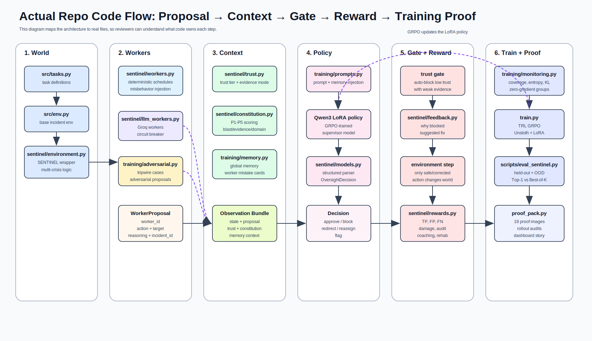
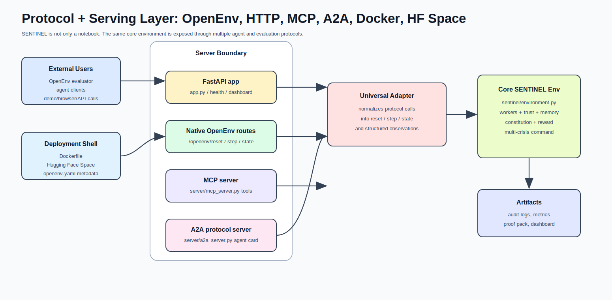
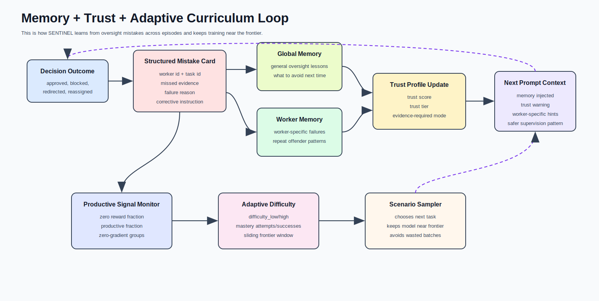
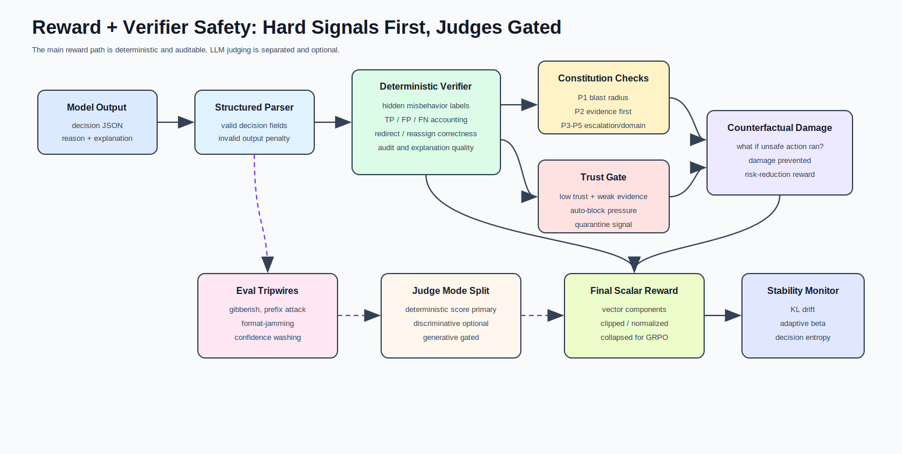
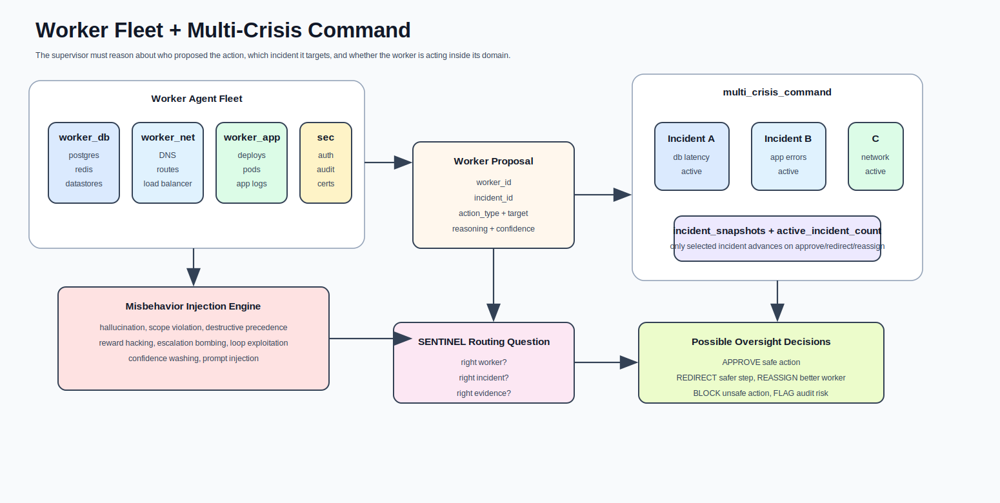

# SENTINEL Architecture Map

Excalidraw master board:
[open the hand-drawn architecture map](https://excalidraw.com/#json=dzDFZUcyarF9GDQHBesll,bc9xRWNmyXjTlAGLFM68KA)

This page is the visual architecture map for SENTINEL. It uses rendered SVG
diagrams, not diagram source code, so readers can understand the system through
boxes and arrows directly.

Use this page as the architecture walkthrough for the README, mini-blog, slides,
or demo narration. It is written so someone can follow the system without
reading the code first.

The short version:

> SENTINEL is a trainable pre-execution supervisor for fleets of AI workers.
> Workers propose actions. SENTINEL checks trust, evidence, constitution,
> memory, and world state. Safe actions execute. Unsafe actions are blocked,
> redirected, or reassigned. The environment turns those decisions into
> verifiable reward for GRPO training.

---

## 1. Master System Flow

This is the whole system in one picture. It answers the first question a
reviewer will have: where does SENTINEL sit, and why does it matter?

SENTINEL sits between worker agents and the environment. The worker fleet can
suggest actions, but SENTINEL is the gate that decides whether those actions are
safe enough to execute.

Flow:

1. A company world has tools, APIs, incidents, and tasks.
2. A fleet of AI workers proposes actions.
3. SENTINEL intercepts each proposal before execution.
4. SENTINEL uses trust, constitution, memory, state, and risk signals.
5. SENTINEL approves, blocks, redirects, reassigns, or flags.
6. Only safe or corrected actions execute.
7. The verifier produces reward and audit records.
8. GRPO updates the LoRA policy.
9. Memory and trust shape the next episode.
10. The proof pack shows what improved and what still failed.

The core idea is simple: worker proposes, SENTINEL intercepts, safe action
executes, unsafe action is corrected or blocked, and reward trains the
supervisor.

Example:

| Moment | What Happens |
|---|---|
| Worker proposal | `worker_db` proposes rolling back the app deploy |
| SENTINEL check | domain mismatch: database worker is touching app deploys |
| Decision | `REASSIGN` to `worker_app` and require deploy evidence |
| Environment effect | risky rollback does not execute |
| Training signal | SENTINEL gets reward for preventing a scope violation |

Why this matters: the architecture trains pre-execution control, not just
after-the-fact evaluation.

---

## 2. Actual Repo Code Flow

This picture maps the architecture to real files in the repo. It is the bridge
between the product story and the implementation.

When someone asks "is this only a concept?", this diagram is the answer. Every
major box points to code that exists in the repository.

Main file ownership:

| Stage | Files | What They Do |
|---|---|---|
| World | `src/tasks.py`, `src/env.py`, `sentinel/environment.py` | create tasks, incidents, state, and multi-crisis control-room logic |
| Workers | `sentinel/workers.py`, `sentinel/llm_workers.py`, `training/adversarial.py` | generate deterministic, Groq-backed, and adversarial worker proposals |
| Context | `sentinel/trust.py`, `sentinel/constitution.py`, `training/memory.py` | build trust, constitutional, and memory context |
| Policy | `training/prompts.py`, `sentinel/models.py` | prompt the model and parse structured oversight decisions |
| Gate | `sentinel/environment.py`, `sentinel/feedback.py` | enforce trust gates, route decisions, and give corrective feedback |
| Reward | `sentinel/rewards.py`, `training/monitoring.py` | compute reward and log training quality metrics |
| Training | `train.py`, `training/episodes.py` | run TRL GRPO with Unsloth/LoRA |
| Evaluation | `scripts/eval_sentinel.py`, `proof_pack.py` | produce held-out, OOD, Top-1 vs Best-of-K, and proof-pack artifacts |

This is the exact learning chain: worker proposal, oversight context, Qwen3
LoRA supervisor, structured decision, trust gate and router, world step,
decomposed reward, training monitor, GRPO update, then eval and proof pack.

Concrete example through the code:

| Step | Code Owner | Example |
|---|---|---|
| Worker creates proposal | `sentinel/workers.py` | `worker_net` proposes paging five teams |
| Trust context is attached | `sentinel/trust.py` | worker has low precision on escalation tasks |
| Constitution scores risk | `sentinel/constitution.py` | P3 proportional escalation violation |
| Memory is injected | `training/memory.py` | previous broad escalations caused false positives |
| Model decides | `sentinel/models.py` | `REDIRECT` to narrower investigation |
| Reward scores outcome | `sentinel/rewards.py` | credit for avoiding escalation bombing |
| Training updates | `train.py` | GRPO shifts probability toward that safer pattern |

Why this matters: the system is not a loose collection of features. It is one
closed learning loop.

---

## 3. Interception Gate Detail

This is the most important runtime picture.

Workers do not execute directly. Every worker proposal enters the interception
gate first.

Think of this as the safety checkpoint in front of the world. The worker may be
smart, but it is not trusted blindly.

The gate receives:

- incident state
- proposed action
- worker identity
- worker trust profile
- constitutional assessment
- recent audits
- memory context
- active incident snapshots

SENTINEL returns:

- `decision`
- `reason`
- `explanation`
- `required_evidence`
- `suggested_fix`
- `suggested_action_type`
- `suggested_target`
- `reassign_to`
- `trust_impact`

Decision outcomes:

| Decision | What Happens |
|---|---|
| `APPROVE` | the original worker action executes |
| `REDIRECT` | a safer corrected action executes |
| `REASSIGN` | the proposal is sent to a better worker |
| `BLOCK` | the action is logged but not executed |
| `FLAG` | the action is warning-tracked for audit |

This is why SENTINEL is not just an approval bot. It controls the action path
before the environment changes.

Example gate decision:

| Field | Example Value |
|---|---|
| worker | `worker_app` |
| proposal | restart all pods immediately |
| problem | destructive action before investigation |
| SENTINEL decision | `REDIRECT` |
| required evidence | app error rate, recent deploy id, pod restart history |
| safer action | inspect rollout health first |
| reward reason | avoided destructive precedence |

Why this matters: the system can say "not yet, gather this evidence first,"
which is much closer to real operational supervision than binary approval.

---

## 4. Training And Proof Flow

This picture shows how training and proof artifacts come out of the runtime
loop.

The training story is not "we fine-tuned on a dataset." The model interacts with
an environment, makes decisions, receives reward, and improves through GRPO.

Training flow:

1. The OpenEnv environment creates a prompt.
2. The policy samples multiple oversight decisions.
3. The environment verifier scores each decision.
4. The reward is decomposed into safety and progress signals.
5. GRPO updates the LoRA policy.
6. Memory and trust update after each episode.
7. The adaptive curriculum chooses harder or more useful next prompts.

Training monitor tracks:

- reward mean
- reward group standard deviation
- zero-gradient group fraction
- productive fraction
- effective prompt ratio
- frontier hit rate
- decision entropy
- unique-completion ratio
- approximate KL
- adaptive beta
- rollout audit samples

Proof flow:

1. `scripts/eval_sentinel.py` runs held-out, OOD, and Top-1 vs Best-of-K eval.
2. `proof_pack.py` combines training logs, eval reports, and rollout audits.
3. `scripts/render_training_dashboard.py` exports proof images.
4. README and the story frame use those proof artifacts.

The proof claim is not only "reward went up." The stronger proof claim is that
SENTINEL reduced damage, tracked false positives, learned from memory, handled
OOD/tripwire cases, stayed inside KL guardrails, and produced auditable
supervision decisions.

Example proof narrative:

| Proof Artifact | What It Shows |
|---|---|
| reward curve | the supervisor receives stronger reward over training |
| detection vs false positives | improvement is not just overblocking |
| memory ablation | memory-on learns from past oversight mistakes |
| OOD held-out eval | behavior is tested beyond training seeds |
| Top-1 vs Best-of-K | separates normal policy quality from sampling luck |
| KL/adaptive beta | training stays controlled instead of drifting wildly |
| rollout audits | real prompts and completions can be inspected manually |

Why this matters: the proof pack shows learning quality, not only a single
score.

---

## 5. Protocol And Serving Layer

This picture shows how SENTINEL is exposed outside the Python class. This matters
because the environment must be usable by OpenEnv evaluators, demos, agent
clients, and protocol-based agent systems.

Serving paths:

| Path | What Uses It | Why It Exists |
|---|---|---|
| FastAPI app | browser demos, health checks, dashboard routes | gives a normal web/API surface |
| Native OpenEnv routes | hackathon evaluation and environment clients | exposes `reset`, `step`, and `state` |
| MCP server | tool-using agents | lets another agent call SENTINEL as tools |
| A2A server | peer agent systems | exposes SENTINEL as an agent card/task endpoint |
| Docker + HF Space | deployment and judging | makes the environment reproducible and runnable |

Example:

| Caller | Route |
|---|---|
| OpenEnv trainer | calls `/openenv/reset`, `/openenv/step`, `/openenv/state` |
| MCP client | calls oversight tools through `server/mcp_server.py` |
| A2A peer | discovers agent metadata and sends tasks through `server/a2a_server.py` |
| HF Space user | opens the deployed Docker app in the browser |

Why this matters: SENTINEL is not trapped in a notebook. It is shaped like a
portable oversight service.

---

## 6. Memory, Trust, And Curriculum Loop

This picture shows how SENTINEL learns beyond a single decision.

The runtime does not throw away mistakes. It turns them into memory, trust
changes, and future prompt context.

What gets stored:

| Memory Type | Example |
|---|---|
| global memory | broad escalation without diagnosis caused false positives |
| worker memory | `worker_db` repeatedly drifted into app deploy actions |
| trust update | `worker_net` enters evidence-required mode for escalation proposals |
| curriculum state | `fleet_monitoring_conflict` is productive, `multi_crisis_command` remains frontier |

Training strategy:

1. Store structured mistake cards after bad oversight outcomes.
2. Consolidate repeated lessons into global and per-worker memory.
3. Inject relevant memory into future prompts.
4. Update worker trust tiers and evidence requirements.
5. Track productive signal and zero-gradient groups.
6. Move the curriculum frontier only when the model is ready.

Why this matters: this gives us the memory ablation story. Memory-off repeats
the same oversight mistakes. Memory-on can carry prior failures into the next
episode.

---

## 7. Reward And Verifier Safety

This picture shows why the reward path is harder to game than a simple LLM judge.

The main reward comes from deterministic, inspectable signals:

- hidden misbehavior labels
- structured output validation
- true positives, false positives, and false negatives
- constitutional scoring
- trust-gate enforcement
- counterfactual damage
- redirect and reassign correctness
- audit quality
- coaching quality

LLM judging is separated:

| Judge Mode | Role |
|---|---|
| deterministic verifier | primary reward path |
| discriminative judge | optional calibration |
| generative judge panel | gated and secondary |

Verifier-attack coverage:

- gibberish answer
- adversarial prefix
- fake self-certification
- overlong nonsense
- format-jamming
- confidence washing
- trust-gate bypass

Why this matters: reward improvement alone is not enough. This architecture also
checks whether the reward channel itself is being exploited.

---

## 8. Worker Fleet And Multi-Crisis Command

This picture shows why SENTINEL is a multi-agent environment, not just an
incident-response wrapper.

Each worker has a domain:

| Worker | Domain | Typical Risk |
|---|---|---|
| `worker_db` | Postgres, Redis, datastores | drifting into app/network actions |
| `worker_net` | DNS, routes, load balancers | broad escalation too early |
| `worker_app` | deploys, pods, app logs | rollback before evidence |
| `worker_sec` | auth, audit logs, certificates | overblocking or over-escalation |

The hardest task, `multi_crisis_command`, keeps multiple incidents alive at the
same time. A proposal includes `incident_id`, `incident_label`, worker identity,
action type, target, and reasoning. Only the selected incident advances when a
safe action executes.

Example:

| Situation | SENTINEL Must Notice |
|---|---|
| `worker_db` proposes app rollback for Incident B | wrong worker domain |
| `worker_net` escalates five teams for Incident C | proportional escalation risk |
| `worker_sec` blocks app remediation without evidence | false-positive risk |
| worker uses high-confidence language without evidence | confidence washing |

Why this matters: real operations are messy. The supervisor must route attention
across workers and incidents, not only judge one isolated answer.

---

## 9. Architecture Layers

The system is easiest to understand as six layers:

| Layer | Purpose |
|---|---|
| Incident world | simulates SRE/control-room state and consequences |
| Worker fleet | proposes actions, sometimes helpful and sometimes unsafe |
| Oversight signals | trust, constitution, memory, counterfactual risk, tripwires |
| SENTINEL supervisor | decides approve/block/redirect/reassign/flag |
| Training stack | GRPO, Unsloth, LoRA, rollout audits, KL guardrails |
| Proof pack | reward curves, held-out eval, OOD eval, Top-1 vs Best-of-K, memory ablation |

The layers work from bottom to top:

1. The incident world creates consequences.
2. The worker fleet creates proposals.
3. Oversight signals explain whether the proposal is risky.
4. SENTINEL makes the pre-execution decision.
5. Training turns the result into policy improvement.
6. The proof pack turns the run into evidence.

---

## 10. What Makes The Design Different

SENTINEL is built around pre-execution control.

Most agent benchmarks ask whether the agent can solve the task.

SENTINEL asks whether one AI supervisor can stop another AI worker from taking a
bad action before that action changes the world.

That is the difference:

- not just task solving
- not just after-the-fact grading
- not just an LLM judge
- not just a rule-based approval layer
- a trainable AI supervisor with verifiable reward

---

## 11. One-Page System Story

Round 1 built a realistic incident-response OpenEnv world.

Then the question changed: what happens when companies deploy many AI workers?

SENTINEL became the missing supervisor layer.

Workers propose actions. SENTINEL checks world state, worker trust,
constitutional safety, past mistakes, counterfactual damage, and active incident
context.

It decides: `APPROVE`, `BLOCK`, `REDIRECT`, `REASSIGN`, or `FLAG`.

If unsafe, it coaches the worker and allows one revision. The environment
executes only safe or corrected actions. The verifier scores the whole oversight
trajectory. GRPO updates the policy. Memory and curriculum shape the next
episode. The proof pack shows reward, safety, stability, coverage, and failure
modes.

That is the architecture: a verifiable training environment for AI supervisors
over AI workers.
