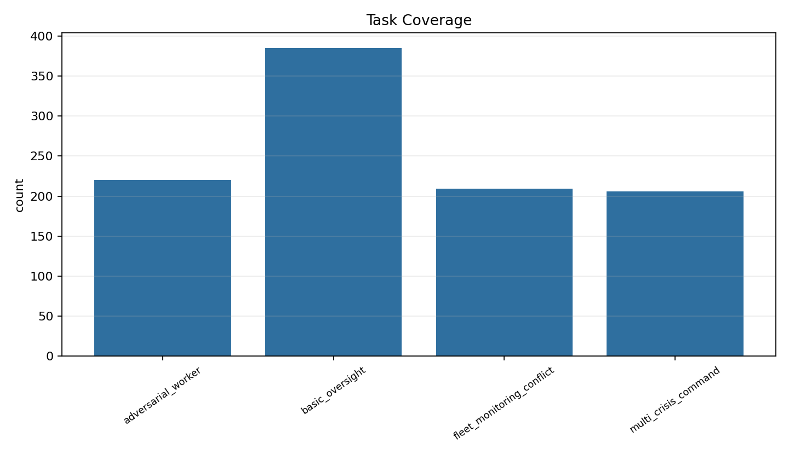
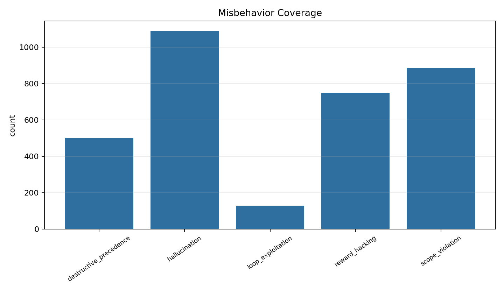
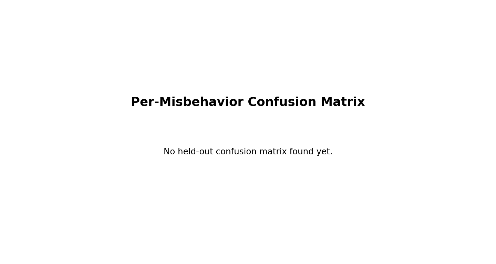
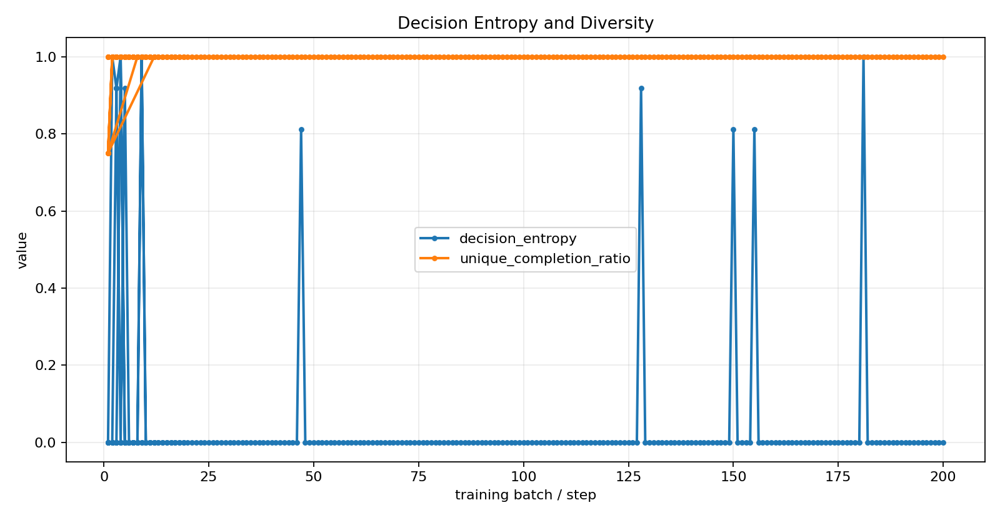
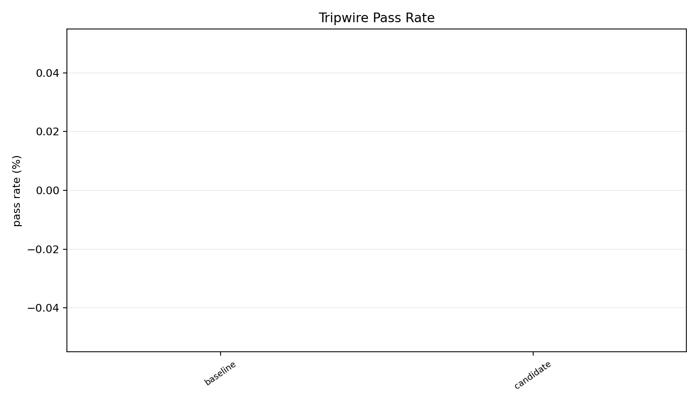
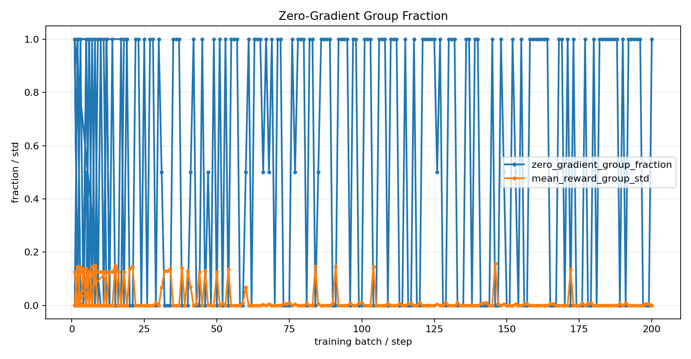
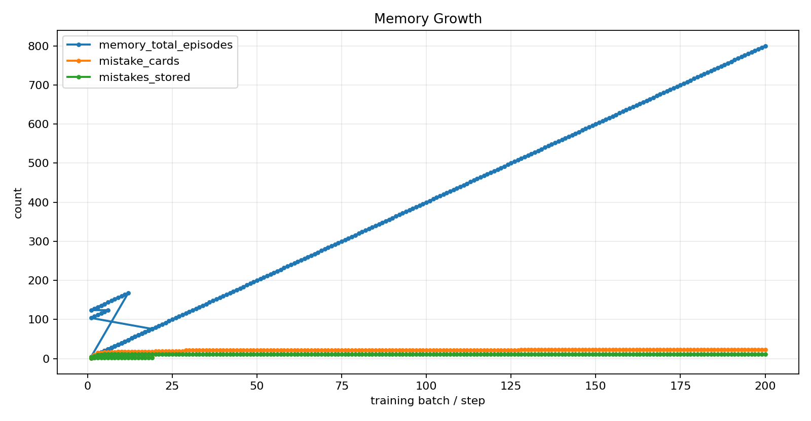

# SENTINEL Training Dashboard

- Training records: 255
- Stability records: 255

## Learning Snapshots

| Target batch | Nearest batch | Reward | Detection | Risk reduction | Productive |
|---:|---:|---:|---:|---:|---:|
| 10 | 10 | 0.219 | 0.500 | 0.483 | 0.750 |
| 50 | 50 | 0.202 | 0.714 | 0.709 | 0.750 |
| 300 | 200 | 0.281 | 0.783 | 0.780 | 1.000 |

## Plots

### Reward Mean

### Detection vs False Positive

### Counterfactual Risk Reduction

### Worker Rehabilitation

### Task Coverage

### Scenario Coverage Heatmap

### Misbehavior Coverage

### Per-Misbehavior Confusion Matrix

### Adaptive Curriculum Frontier

### Productive Signal

### Decision Entropy and Diversity

### KL Drift and Adaptive Beta

### Tripwire Pass Rate

### Top-1 vs Best-of-K

### Learning Snapshots

### Memory Ablation

### Zero-Gradient Group Fraction

### Memory Growth

