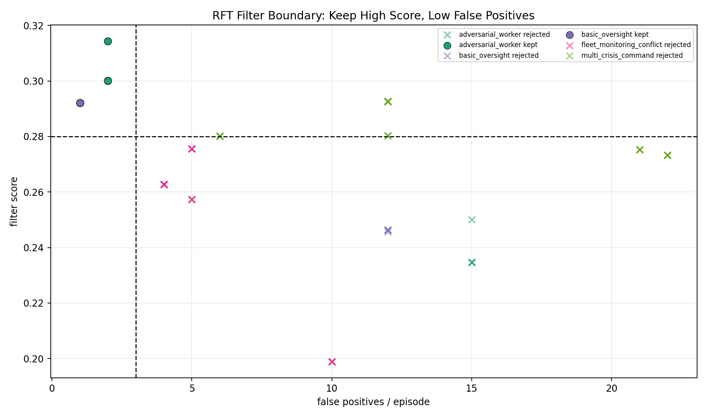
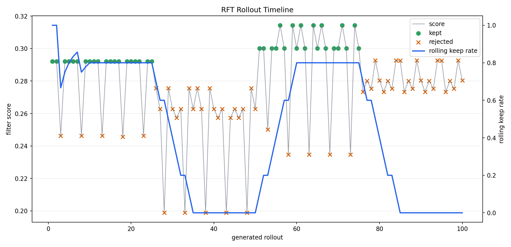
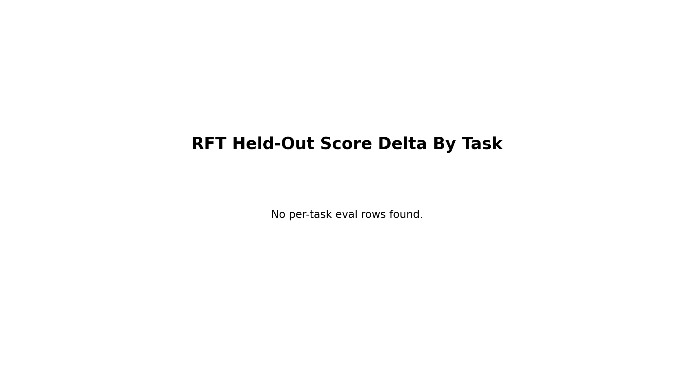

# Phase 1 GRPO + RFT Polish RFT Proof Pack

This folder is the rejection-sampling fine-tuning proof layer. It shows which model-generated rollouts were accepted, which were rejected, and which low-false-positive samples were used for the polish pass. Held-out model evaluation was intentionally omitted for this proof pack.

## Summary

- Total generated rollouts: `100`
- Kept rollouts used for SFT: `40`
- Keep rate: `40.0%`
- Mean rollout score: `0.277`
- Mean kept score: `0.299`
- Mean kept false positives: `1.50`
- RFT status: `ok`
- Output adapter: `see RFT output dir`

## Plots

### 01 Rft Keep Drop By Task

### 02 Rft Score Distribution

### 03 Rft False Positive Distribution

### 04 Rft Score Vs Fp Filter

### 05 Rft Rollout Timeline

### 06 Rft Eval Overview

### 07 Rft Eval Task Delta

